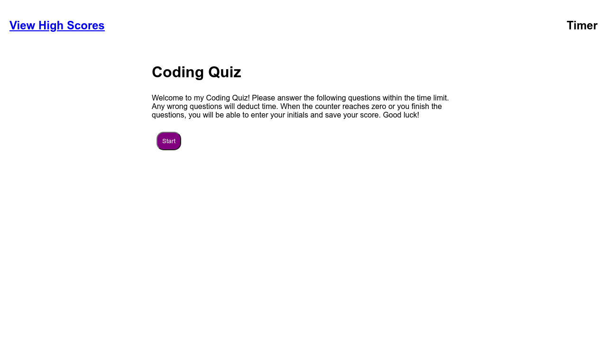

# Coding Quiz

## Purpose
The purpose of this assignment was to create a timed quiz using Javascript in tandem with HTML and CSS. Using DOM methods, I relied on Javascript to implement interactivity to the questions and answers. I also included a countdown timer and sound effects for every right or wrong answer.

## Languages Used
-HTML  
-CSS   
-Javascript

## Website URLs
Live Website: https://jljohnson1454.github.io/coding-quiz/

Github Repo: https://github.com/jljohnson1454/coding-quiz

## Screenshot

## References
Bootcamp Module 4 Activities: https://github.com/the-Coding-Boot-Camp-at-UT/UTA-VIRT-BO-FSF-PT-07-2021-U-B
 
Sound Effects provided by Mixkit https://mixkit.co/

## Author
Created by Jacob Johnson